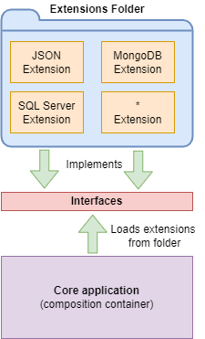
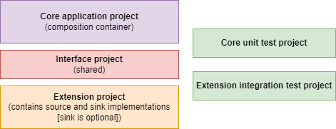

# Azure Cosmos DB Data Migration Tool

> **PLEASE NOTE**
>
> The Azure Cosmos DB Data Migration Tool is undergoing a full refactor to restructure the project to accomplish the following:
>
> - Provide a base cross-platform CLI that is lightweight and serves as the base (core) executable for hosting extensions
> - The extensible framework enables the community to add source and destination targets without modifying the core executable
> - Improve stability
> - Use the latest stable .NET release (currently .NET 6)
> - Use the latest Azure Cosmos DB SDKs

To access the archived version of the tool, navigate to the [**Archive branch**](https://github.com/Azure/azure-documentdb-datamigrationtool/tree/archive).

---

## Cosmos DB Data Migration Tool Architecture

The Cosmos DB Data Migration Tool is a lightweight executable that leverages the [Managed Extensibility Framework (MEF)](https://docs.microsoft.com/en-us/dotnet/framework/mef/). MEF enables decoupled implementation of the core project and its extensions. The core application is a command-line executable responsible for composing the required extensions at runtime by automatically loading them from the Extensions folder of the application. An Extension is a class library that includes the implementation of a System as a Source and (optionally) Sink for data transfer. The core application project does not contain direct references to any extension implementation. Instead, these projects share a common interface.

## Cosmos DB Data Migration Tool Project Structure

The Cosmos DB Data Migration Tool core project is a C# command-line executable. The core application serves as the composition container for the required Source and Sink extensions. Therefore, the application user needs to put only the desired Extension class library assembly into the Extensions folder before running the application. In addition, the core project has a unit test project to exercise the application's behavior, whereas extension projects contain concrete integration tests that rely on external systems.

This project has adopted the [Microsoft Open Source Code of Conduct](https://opensource.microsoft.com/codeofconduct/). For more information see the [Code of Conduct FAQ](https://opensource.microsoft.com/codeofconduct/faq/) or contact [opencode@microsoft.com](mailto:opencode@microsoft.com) with any additional questions or comments.

## Documentation

[Initial usage documentation](docs/developer-guidance.md).
