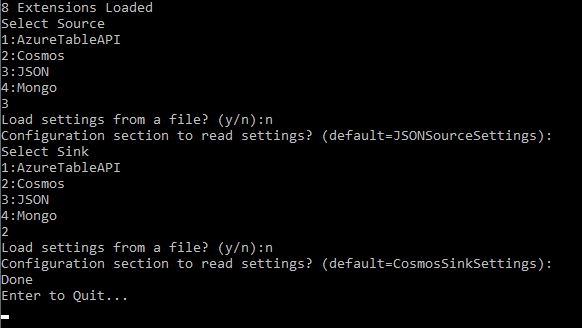

# Developer Guidance

- [Developer Guidance](#developer-guidance)
  - [Prerequisites](#prerequisites)
  - [Clone The Source Code Repository](#clone-the-source-code-repository)
  - [Build The Solution](#build-the-solution)
    - [Build Using Command Line / Terminal](#build-using-command-line--terminal)
  - [Tutorial: JSON To Cosmos DB Migration](#tutorial-json-to-cosmos-db-migration)
    - [Task 1: Provision A Sample Database And Container Using The Azure Cosmos Db Emulator As The Destination](#task-1-provision-a-sample-database-and-container-using-the-azure-cosmos-db-emulator-as-the-destination)
    - [Task 2: Prepare JSON Source Documents](#task-2-prepare-json-source-documents)
    - [Task 3: Setup The Data Migration Configuration](#task-3-setup-the-data-migration-configuration)
  - [Creating Extensions](#creating-extensions)

## Prerequisites

1. [Visual Studio 2022](https://visualstudio.microsoft.com/vs/)
2. [.NET 6.0 SDK](https://dotnet.microsoft.com/en-us/download/dotnet/6.0)
3. [Git](https://github.com/git-guides/install-git)
4. [Azure Cosmos DB Emulator](https://learn.microsoft.com/azure/cosmos-db/local-emulator) or Azure Cosmos DB resource.

## Clone The Source Code Repository

1. From a command prompt, execute the following command in an empty working folder that will house the source code.

```shell
git clone https://github.com/Azure/azure-documentdb-datamigrationtool.git
```

## Build The Solution

1. Using Visual Studio 2022, open `CosmosDbDataMigrationTool.sln`.

2. Build the project using the keyboard shortcut `Ctrl`+`Shift`+`B` (`Cmd`+`Shift`+`B` on macOS). This will build all current extension projects as well as the command-line **Core** application. The extension projects build assemblies get written to the **Extensions** folder of the **Core** application build. All extension options will be available when the application is run.

### Build Using Command Line / Terminal

- See [build-debug.sh](../build-debug.sh) and [build-release.sh](../build-release.sh) scripts.

## Tutorial: JSON To Cosmos DB Migration

This tutorial outlines how to use the Cosmos DB Data Migration tool to move JSON data to Azure Cosmos DB. This tutorial uses the Azure Cosmos DB Emulator.

### Task 1: Provision A Sample Database And Container Using The Azure Cosmos Db Emulator As The Destination

1. Launch the Azure Cosmos DB emulator application and open <https://localhost:8081/_explorer/index.html> in a browser.

2. Select the **Explorer** option from the left menu. Then choose the **New Database** link found beneath the **Common Tasks** heading.

    

3. On the **New Database** blade, enter `datamigration` in the **Database id** field, then select **OK**.

    

4. If the **datamigration** database doesn't appear in the list of databases, select the **Refresh** icon.

    

5. Expand the ellipsis menu next to the **datamigration** database and select **New Container**.

   

6. On the **New Container** blade, enter `btcdata` in the **Container id** field, and `/id` in the **Partition key** field.  Select the **OK** button.

    

    >**Note**: When using the Cosmos DB Data Migration tool, the container doesn't have to previously exist, it will be created automatically using the partition key specified in the sink configuration.

### Task 2: Prepare JSON Source Documents

1. Locate the **docs/resources/sample-data.zip** file. Extract the files to any desired folder. These files serve as the JSON data that is to be migrated to Cosmos DB.

### Task 3: Setup The Data Migration Configuration

1. Each extension contains a README document that outlines configuration for the data migration. In this case, locate the configuration for [JSON (Source)](https://github.com/Azure/azure-documentdb-datamigrationtool/tree/feature/begin-core/Extensions/Json/Microsoft.DataTransfer.JsonExtension) and [Cosmos DB (Sink)](https://github.com/Azure/azure-documentdb-datamigrationtool/tree/feature/begin-core/Extensions/Cosmos/Microsoft.DataTransfer.CosmosExtension).

2. In the Visual Studio Solution Explorer, expand the **Microsoft.Data.Transfer.Core** project, and open **appsettings.json**. This file provides an example outline of the settings file structure. Using the documentation linked above, configure the **JsonSourceSettings** and **CosmosSinkSettings** sections. Ensure the **FilePath** setting is the location where the sample data is extracted. The ConnectionString setting can be found on the Cosmos DB Emulator **Quickstart** screen as the **Primary Connection String**. Save the file.

    ```json
    {
        "JSONSourceSettings": {
            "FilePath": "C:\\btcdata\\simple_json.json"
        },
        "CosmosSinkSettings": {
            "ConnectionString": "AccountEndpoint=https://localhost:8081/;AccountKey=C2y6yDj...",
            "Database": "datamigration",
            "Container": "btcdata",
            "PartitionKeyPath": "/id",
            "RecreateContainer": false,
            "IncludeMetadataFields": false
        }
    }
    ```

    

    >**NOTE**: Currently the Cosmos DB Data migration tool expects a single JSON file containing an array of objects.

3. Ensure the **Microsoft.DataTransfer.Core** project is set as the startup project then press `F5` to run the application.

4. The application will load the provided extensions, then prompt for a **Source**. Select **JSON**. When prompted to load settings from a file enter `n` and press `Enter`. The application provides the ability to configure extensions in a separate file versus having them located in the **appsettings.json** file. When a separate file is not specified, the settings are read from **appsettings.json**. When prompted to provide the Configuration section name, press `Enter` to accept the default: **JSONSourceSettings**.

    

5. The application will then prompt for a **Sink**, choose **Cosmos**. When prompted to load settings from a file enter `n` and press `Enter`. The application provides the ability to configure extensions in a separate file versus having them located in the **appsettings.json** file. When a separate file is not specified, the settings are read from **appsettings.json**. When prompted to provide the Configuration section name, press `Enter` to accept the default: **CosmosSinkSettings**.

    

6. The application then performs the data migration. After a few moments the process will indicate **Done**.

    

## Creating Extensions

1. Add a new folder in the `Extensions` folder with the name of your extension.

2. Create the extension project and an accompanying test project.
    - The naming convention for extension projects is `Microsoft.DataTransfer.<ExtensionName>`.
    - Extension projects should use .NET 6 framework and **Console Application** type. A `Program.cs` file must be included in order to build the console project. A Console Application Project is required to have the build include NuGet referenced packages.

3. Add the new projects to the `CosmosDbDataMigrationTool` solution.

4. In order to facilitate local debugging the extension build output along with any dependencies needs to be copied into the `Core\Microsoft.DataTransfer.Core\bin\{Debug,Release}\net6.0\Extensions` folder. To set up the project to automatically copy the extensions, add the following changes.

    - Add a Publish Profile to Folder named `LocalDebugFolder` with a Target Location of `..\..\..\Core\Microsoft.DataTransfer.Core\bin\Debug\net6.0\Extensions`.
    - Add a Publish Profile to Folder named `LocalReleaseFolder` with a Target Location of `..\..\..\Core\Microsoft.DataTransfer.Core\bin\Release\net6.0\Extensions`.
    - To publish every time the project builds, edit the `.csproj` file to add a new post-build step:

    ```xml
    <Target Name="PublishDebug" AfterTargets="Build" Condition=" '$(Configuration)' == 'Debug' ">
      <Exec
        Command="dotnet publish --configuration Debug --no-build -p:PublishProfile=LocalDebugFolder" />
    </Target>
    <Target Name="PublishRelease" AfterTargets="Build" Condition=" '$(Configuration)' == 'Release' ">
      <Exec
        Command="dotnet publish --configuration Release --no-build -p:PublishProfile=LocalReleaseFolder" />
    </Target>
    ```

5. Add references to the `System.ComponentModel.Composition` NuGet package and the `Microsoft.DataTransfer.Interfaces` project.

6. Extensions can implement either `IDataSourceExtension` to read data or `IDataSinkExtension` to write data. Classes implementing these interfaces should include a class level `System.ComponentModel.Composition.ExportAttribute` with the implemented interface type as a parameter. This will allow the plugin to get picked up by the main application.

7. Settings needed by the extension can be retrieved from any standard .NET configuration source in the main application by using the `IConfiguration` instance passed into the `ReadAsync` and `WriteAsync` methods. Settings under `SourceSettings`/`SinkSettings` will be included as well as any settings included in JSON files specified by the `SourceSettingsPath`/`SinkSettingsPath`.

8. Implement your extension to read and/or write using the generic `IDataItem` interface which exposes object properties as a list key-value pairs. Depending on the specific structure of the data storage type being implemented, you can choose to support nested objects and arrays or only flat top-level properties.
